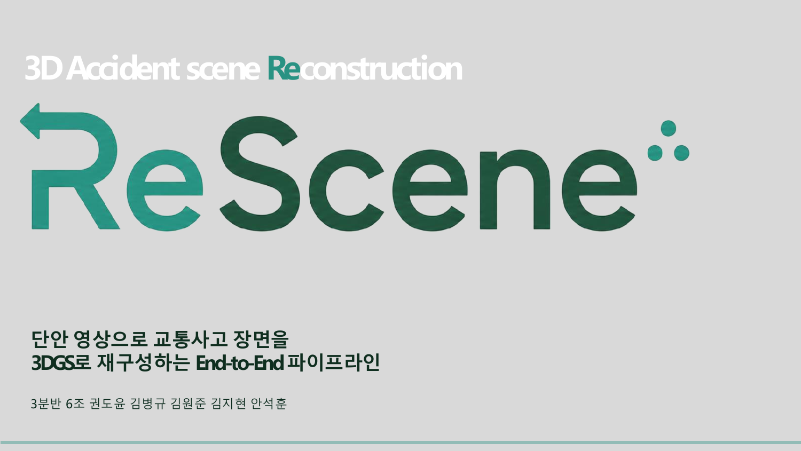
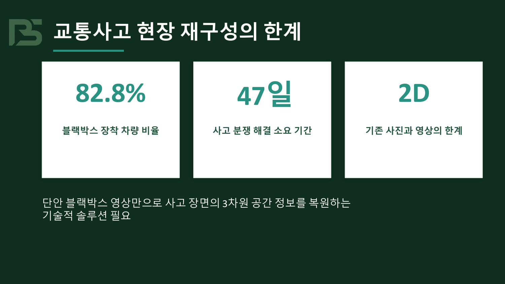
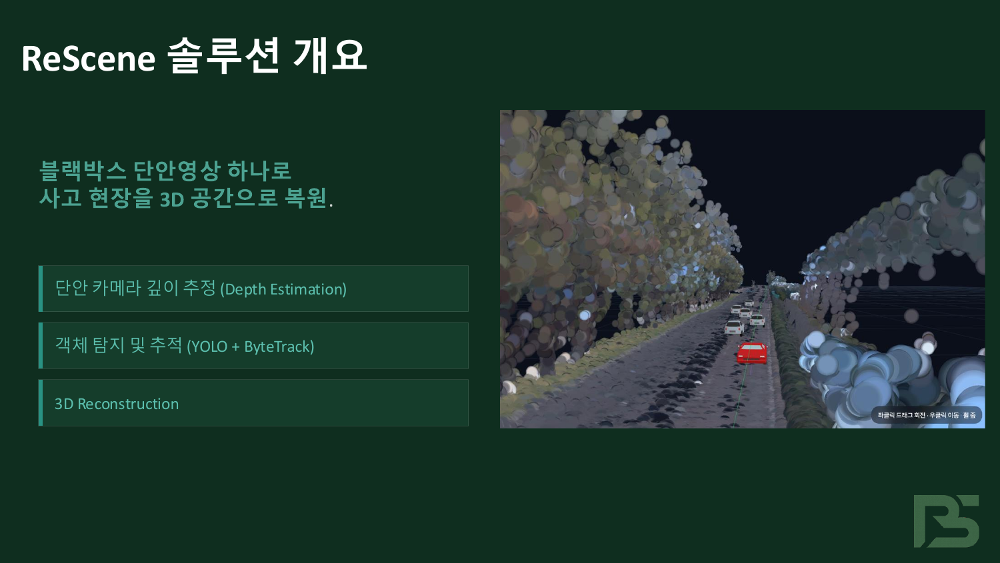
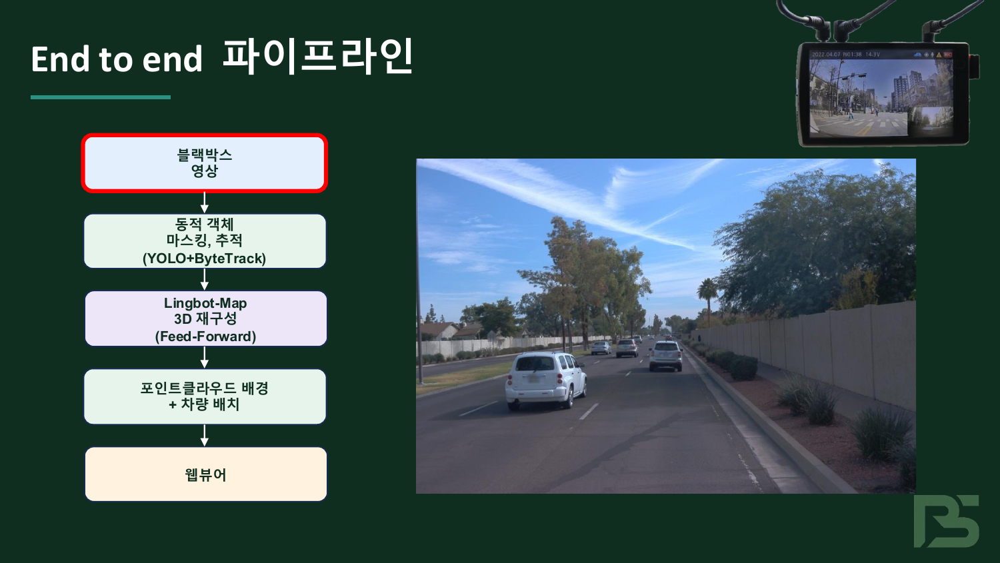
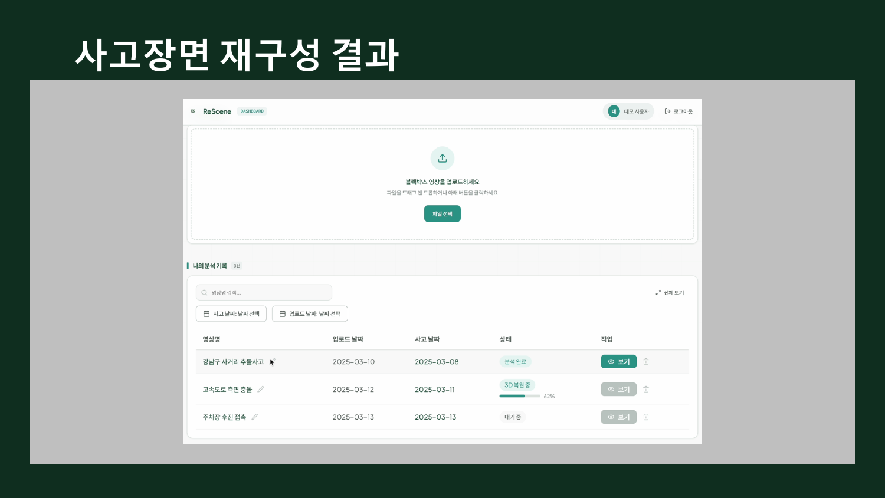
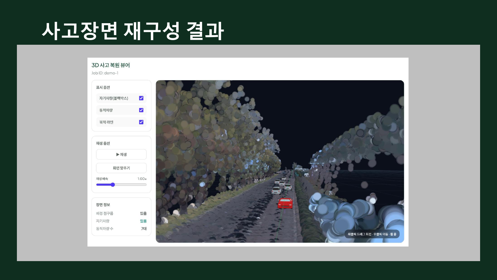
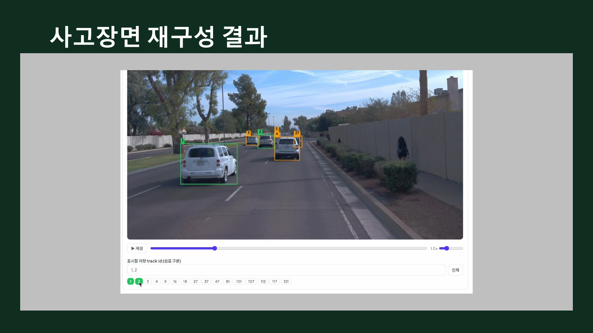
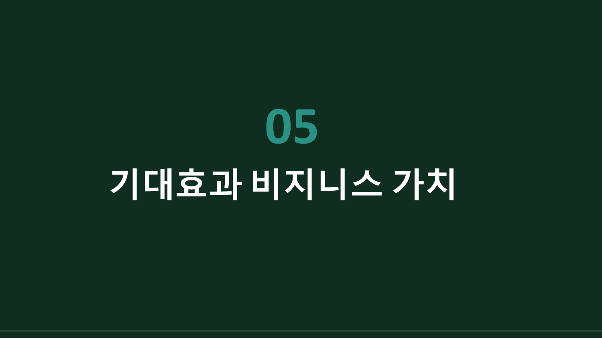
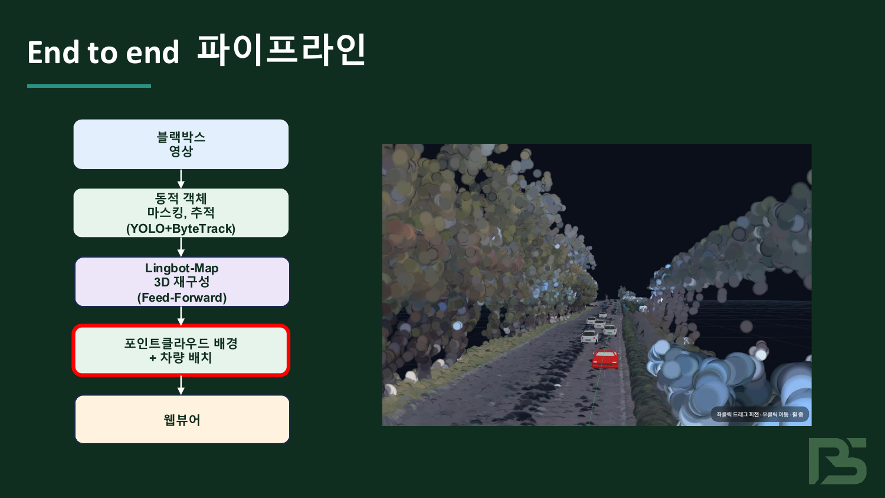
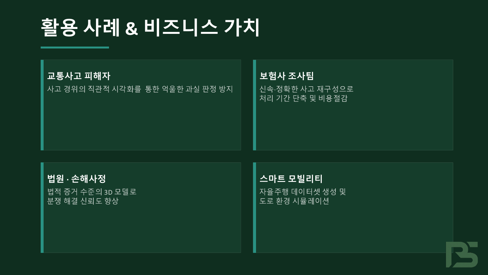

<p align="center">
  
</p>

<h1 align="center">ReScene</h1>

<p align="center">
  <b>단안(單眼) 블랙박스 영상 한 대로 교통사고 장면을 3D로 재구성하는 End-to-End 파이프라인</b><br>
  <sub>LiDAR · 다중 카메라 없이, 평범한 블랙박스 영상만으로 사고 현장의 3차원 공간을 복원합니다.</sub>
</p>

<p align="center">
  
  
  
  
  
  
  
  
  
</p>

---

## 📖 목차

1. [문제 제기](#-문제-제기)
2. [솔루션 개요](#-솔루션-개요)
3. [핵심 기능](#-핵심-기능)
4. [End-to-End 파이프라인](#-end-to-end-파이프라인)
5. [결과 / 데모](#-결과--데모)
6. [기술 스택](#-기술-스택)
7. [시작하기](#-시작하기)
8. [활용 사례 & 비즈니스 가치](#-활용-사례--비즈니스-가치)
9. [팀](#-팀)

---

## 🚨 문제 제기

<p align="center">
  
</p>

- **82.8%** — 국내 차량의 블랙박스 장착 비율. 사고 영상은 넘쳐나지만,
- **47일** — 사고 분쟁 해결에 걸리는 평균 기간. 2D 영상만으로는 충돌 순간의 공간 관계·속도·궤적을 객관적으로 입증하기 어렵습니다.
- **2D의 한계** — 기존 사진·영상은 깊이 정보가 없어 "누가 어디서 어떤 속도로" 움직였는지 다툼이 끊이지 않습니다.

> 단안 블랙박스 영상만으로 사고 장면의 **3차원 공간 정보를 복원**하는 기술적 솔루션이 필요합니다.

---

## 💡 솔루션 개요

<p align="center">
  
</p>

**ReScene** 은 블랙박스 단안 영상 하나를 입력받아 사고 현장을 3D 공간으로 복원합니다.

- 🎥 **단안 카메라 깊이 추정** (Monocular Depth Estimation)
- 🚗 **동적 객체 탐지 및 추적** (YOLO + ByteTrack)
- 🌐 **3D 재구성** (LingBot-MAP 피드포워드) + 웹 뷰어 렌더링

LiDAR나 다중 카메라 없이, 누구나 가진 블랙박스 영상만으로 **충돌 순간의 궤적과 속도를 객관적으로 분석**할 수 있게 합니다.

---

## ✨ 핵심 기능

| | 기능 | 설명 |
|---|---|---|
| 🎬 | **단안 영상 업로드** | 블랙박스/대시캠 영상 한 개만 업로드하면 끝 |
| 🧠 | **동적/정적 분리** | 움직이는 차량을 마스킹해 깨끗한 배경 맵을 복원 (ego-motion 보정 포함) |
| 🗺️ | **3D 배경 복원** | LingBot-MAP 피드포워드 재구성으로 포즈 노이즈에 강건한 포인트클라우드 생성 |
| 🚘 | **차량 궤적 복원** | ego 차량 + 주변 차량의 3D 궤적을 시간축에 따라 배치 |
| 🖥️ | **인터랙티브 웹 뷰어** | Three.js 기반 3D 뷰어 — 재생/타임라인/차량 필터/시점 회전 |
| 🔐 | **사용자 워크스페이스** | 로그인(OAuth) · 영상별 분석 기록 관리 · 처리 상태 추적 |

---

## 🔧 End-to-End 파이프라인

<p align="center">
  
</p>

```
블랙박스 영상
   │
   ▼
동적 객체 마스킹·추적  (YOLO + ByteTrack)   ── 움직이는 차량 분리 + track ID 부여
   │
   ▼
LingBot-MAP 3D 재구성  (Feed-Forward)      ── 단안 영상 → 깊이/카메라 포즈 → 3D 포인트
   │
   ▼
포인트클라우드 배경 + 차량 배치             ── 지면 정렬 후 ego/주변 차량을 궤적에 따라 배치
   │
   ▼
웹 뷰어  (React + Three.js)                ── 타임라인·재생·차량 필터 인터랙션
```

> **왜 LingBot-MAP인가?** 전방 주행 단안 영상은 시차(parallax)가 작아 COLMAP 포즈 + 3DGS로는 스파이크/블러가 심한 결과가 나왔습니다. 피드포워드 단안 재구성인 LingBot-MAP은 포즈 노이즈에 강건해 배경 맵 백엔드로 채택했습니다.

---

## 🎯 결과 / 데모

<table>
  <tr>
    <td width="50%"></td>
    <td width="50%"></td>
  </tr>
  <tr>
    <td align="center"><sub>랜딩 페이지</sub></td>
    <td align="center"><sub>대시보드 — 영상 업로드 & 분석 기록</sub></td>
  </tr>
  <tr>
    <td width="50%"></td>
    <td width="50%"></td>
  </tr>
  <tr>
    <td align="center"><sub>3D 사고 복원 뷰어 (배경 + ego/주변 차량 + 궤적)</sub></td>
    <td align="center"><sub>원본 프레임 위 track ID 오버레이 — 보고 싶은 차량만 필터</sub></td>
  </tr>
</table>

<p align="center">
  <br>
  <sub>단안 영상으로 복원한 도로 배경 포인트클라우드 위에 빨간색 ego 차량과 주변 차량을 배치</sub>
</p>

---

## 🛠 기술 스택

| 영역 | 스택 |
|---|---|
| **Frontend** | React 19, TypeScript, Vite, Three.js (`@react-three/fiber`), Tailwind CSS |
| **Backend** | Spring Boot 3.5 (Java 17), Spring Security + OAuth2, JWT, JPA, MySQL, Redis |
| **AI Pipeline** | Python, PyTorch, YOLOv8-seg + ByteTrack, LingBot-MAP, Open3D |
| **Infra** | Docker Compose (MySQL · Redis), GPU 서버 추론 (RTX A5000, CUDA) |

---

## 🚀 시작하기

```bash
git clone https://github.com/Blackbox3DGS/3DGS.git
cd 3DGS
```

### 1) Frontend (웹 뷰어)

```bash
cd frontend
pnpm install
pnpm dev          # http://localhost:3000
```

### 2) Backend (인증 / 작업 관리 API)

```bash
cd backend
docker compose up -d                                          # MySQL + Redis

cp src/main/resources/application-secret.yml.example \
   src/main/resources/application-secret.yml                  # 시크릿 채우기 (DB/JWT/OAuth)

./gradlew bootRun                                             # http://localhost:8080
```

> OAuth 자격증명이 없어도 `application-secret.yml` 의 dummy 값으로 컨텍스트가 부팅되며, **ID/PW 로그인은 정상 동작**합니다. 실제 소셜 로그인은 Google/Naver/Kakao 콘솔에서 발급한 키를 넣으면 활성화됩니다.
> Redirect URI: `http://localhost:8080/login/oauth2/code/{google|naver|kakao}`

### 3) AI Pipeline (GPU 서버에서 실행)

```bash
# Stage 02(프레임 추출) + Stage 03(세그멘테이션·추적)
python ai-pipeline/src/pipeline/run_pipeline.py --input <video> --steps 02_ingest,03_seg

# LingBot 씬 익스포트 → 웹 렌더용 .splat + vehicles.json 생성
CUDA_VISIBLE_DEVICES=0 python ai-pipeline/scripts/lingbot_scene_export.py \
  --model_path <lingbot-checkpoint.pt> \
  --image_folder <run>/02_ingest/images_colmap \
  --dynamic_mask_dir <run>/03_seg/masks \
  --bbox_sequence <run>/03_seg/bbox_sequence.json \
  --out_splat out/scene.splat --out_vehicles out/scene_vehicles.json
```

---

## 💼 활용 사례 & 비즈니스 가치

<p align="center">
  
</p>

- **교통사고 피해자** — 사고 경위의 직관적 시각화로 억울한 과실 판정 방지
- **보험사 조사팀** — 신속·정확한 사고 재구성으로 처리 기간 단축 및 비용 절감
- **법원 · 손해사정** — 법적 증거 수준의 3D 모델로 분쟁 해결 신뢰도 향상
- **스마트 모빌리티** — 자율주행 데이터셋 생성 및 도로 환경 시뮬레이션

---

## 📁 리포지토리 구조

```text
3DGS
├── ai-pipeline   # AI 파이프라인 (프레임 추출 · 세그멘테이션 · 3D 재구성)
├── backend       # Spring Boot — 인증/OAuth · 작업 관리 API · DB
├── frontend      # React + Three.js — 웹 뷰어 및 서비스 UI
└── docs          # 문서 및 에셋
```

---

## 👥 팀

**3분반 6조** · 권도윤 · 김병규 · 김원준 · 김지현 · 안석훈

<sub>2025 졸업작품 — 3D Accident Scene Reconstruction</sub>

---

## 📜 라이선스 / 오픈소스 고지

| 구성요소 | 라이선스 |
|---|---|
| YOLOv8-seg | AGPL-3.0 |
| ByteTrack | MIT |
| LingBot-MAP | 원저작권자 라이선스 준수 ([robbyant/lingbot-map](https://github.com/robbyant/lingbot-map)) |
| Open3D | MIT |
| Three.js · React | MIT |

> 본 프로젝트는 교육·연구 목적의 졸업작품이며, 일부 의존성(예: AGPL/비상업 라이선스)의 상업적 이용 시 각 라이선스 조건을 확인해야 합니다.
