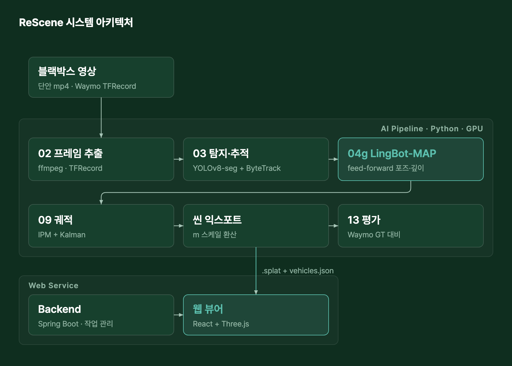
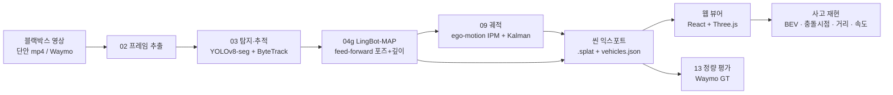
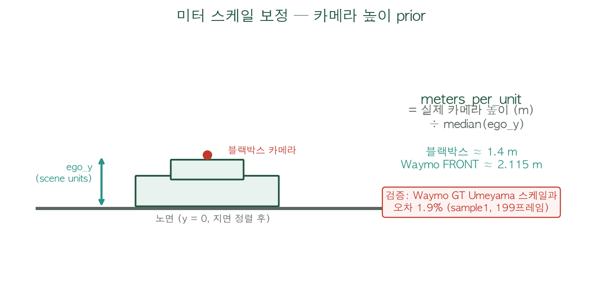
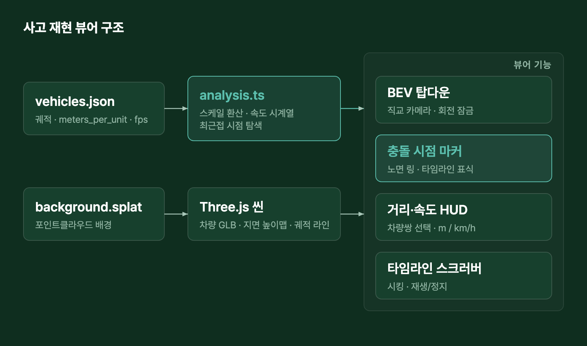
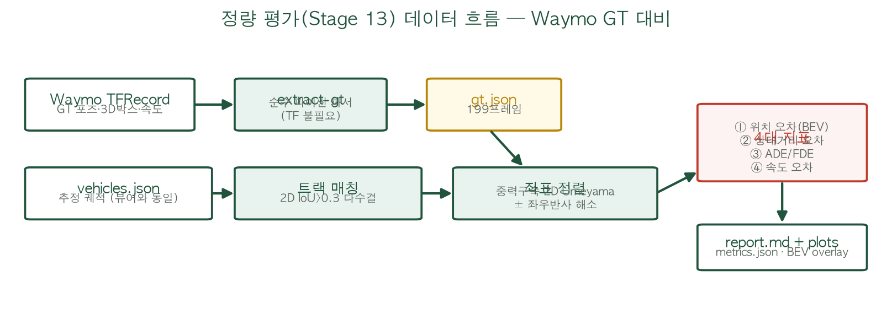
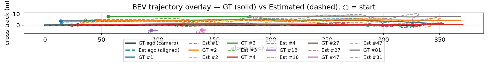
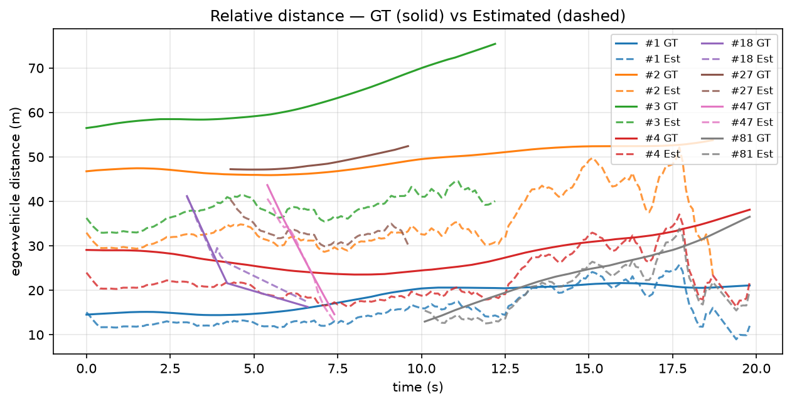
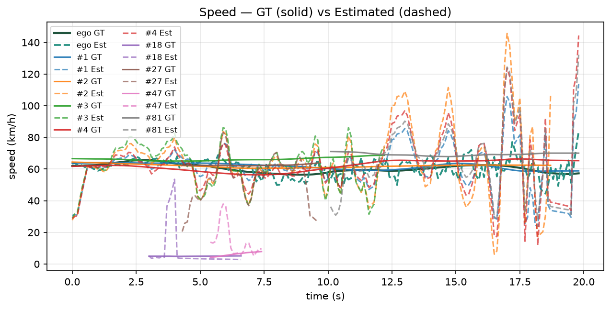

<p align="center">
  
</p>

<h1 align="center">ReScene</h1>

<p align="center">
  <b>단안(單眼)<sup><a href="#용어-설명">[1]</a></sup> 블랙박스 영상 한 대로 교통사고 장면을 3D로 재구성·재현하는 End-to-End 파이프라인</b><br>
  <sub>LiDAR · 다중 카메라 없이, 평범한 블랙박스 영상만으로 사고 순간의 차량 위치·거리·속도를 복원합니다.</sub>
</p>

<p align="center">
  
  
  
  
  
  
  
  
  
</p>

---

## 📖 목차

1. [프로젝트 목표](#-프로젝트-목표)
2. [문제 제기](#-문제-제기)
3. [시스템 아키텍처](#-시스템-아키텍처)
4. [End-to-End 파이프라인](#-end-to-end-파이프라인)
5. [사고 재현 뷰어](#-사고-재현-뷰어)
6. [정량 평가 — Waymo GT 대비](#-정량-평가--waymo-gt-대비)
7. [결과 / 데모](#-결과--데모)
8. [시작하기](#-시작하기)
9. [리포지토리 구조](#-리포지토리-구조)
10. [한계와 향후 과제](#-한계와-향후-과제)
11. [기술 스택 · 팀 · 라이선스](#-기술-스택)
12. [용어 설명](#용어-설명)

---

## 🎯 프로젝트 목표

> **"주행 장면 재생"이 아니라 "사고 장면 재현"** — 과실 판단을 보조할 수 있는 **BEV<sup><a href="#용어-설명">[2]</a></sup> 기반 사고 재현**이 이 프로젝트의 최종 목표입니다.

블랙박스 영상 하나를 넣으면:

1. 배경 3D 공간(도로·건물)을 복원하고,
2. 자기차량(ego)과 주변 차량의 **3D 궤적**을 추출한 뒤,
3. 웹 뷰어에서 **탑다운(BEV) 시점**으로 사고를 재생하며 — **충돌 시점 · 차간 거리(m) · 차량 속도(km/h)** 를 확인할 수 있습니다.
4. 추정 정확도는 LiDAR 정답이 있는 **Waymo 데이터로 정량 평가**해 수치로 제시합니다.

---

## 🚨 문제 제기

<p align="center">
  
</p>

- **82.8%** — 국내 차량의 블랙박스 장착 비율. 사고 영상은 넘쳐나지만,
- **47일** — 사고 분쟁 해결에 걸리는 평균 기간. 2D 영상만으로는 충돌 순간의 공간 관계·속도·궤적을 객관적으로 입증하기 어렵습니다.
- **2D의 한계** — 기존 사진·영상은 깊이 정보가 없어 "누가 어디서 어떤 속도로" 움직였는지 다툼이 끊이지 않습니다.
- 전문 사고 재구성(LiDAR + 다중 카메라)은 고비용·전문가 전용 — 일반 피해자는 접근이 어렵습니다.

---

## 🏗 시스템 아키텍처

<p align="center">
  
</p>



**왜 COLMAP+3DGS가 아니라 LingBot-MAP인가?**
전방 직진 주행 영상은 시차(parallax)<sup><a href="#용어-설명">[3]</a></sup>가 작아 COLMAP<sup><a href="#용어-설명">[4]</a></sup> 포즈 추정이 불안정하고, 그 포즈로 학습한 3DGS는 스파이크/블러가 심했습니다. **LingBot-MAP**은 반복 최적화 없이 한 번의 추론(feed-forward)으로 카메라 포즈와 깊이를 동시에 추정해 포즈 노이즈에 강건하고, 긴 주행 영상도 안정적으로 처리합니다. (COLMAP 경로는 ablation 용도로 유지)

---

## 🔧 End-to-End 파이프라인

각 스테이지는 독립 실행·교체 가능한 모듈이며 오케스트레이터(`ai-pipeline/src/pipeline/run_pipeline.py`)가 아티팩트를 넘겨 연결합니다.

| Stage | 이름 | 입력 → 출력 | 핵심 기술 |
|---|---|---|---|
| 02 | 프레임 추출 | 영상/TFRecord → `images_colmap/` (10 fps) | ffmpeg, Waymo 파서 |
| 03 | 탐지·추적 | 프레임 → 동적 마스크 + `bbox_sequence.json` (track id) | YOLOv8-seg + ByteTrack, ego-motion 보정 |
| 04g | 3D 재구성 | 프레임+마스크 → 포즈·깊이·월드포인트 | **LingBot-MAP** (feed-forward) |
| 07/08 | 배경 포인트클라우드 | 깊이 역투영 → 필터링된 dense PC | Open3D SOR |
| 09 | 차량 궤적 | bbox+깊이+포즈 → 트랙별 3D 궤적 | ROI 깊이 샘플링, AB3DMOT Kalman |
| — | 씬 익스포트 | → `.splat` + `vehicles.json` (**meters_per_unit 포함**) | 지면 정렬, ego-motion IPM<sup><a href="#용어-설명">[5]</a></sup> |
| 12 | 뷰어 데이터 | → 웹 뷰어 서빙 포맷 | — |
| **13** | **정량 평가** | vehicles.json + Waymo GT → `metrics.json`/`report.md` | 중력구속 Umeyama<sup><a href="#용어-설명">[6]</a></sup>, 4대 지표 |

**동적 차량 배치 (ego-motion IPM)** — 직진 주행에서 LingBot의 yaw가 불안정하므로, 신뢰할 수 있는 신호만 사용합니다: ① 부드러운 ego 카메라 경로, ② 지면 정렬(y-up), ③ 각 트랙의 bbox 하단 행. 화면에서 지평선에 가까운(위쪽) 차량일수록 멀리 배치되어 **전후 순서는 보장**되고, 횡방향은 단안 한계로 근사입니다 — 이 특성은 아래 정량 평가에서 전방/횡방향 분해로 정직하게 검증했습니다.

### 미터 스케일 보정

LingBot 좌표계는 미터가 아닙니다. 지면 정렬 후 노면이 y=0이 되므로, **ego 카메라의 씬 내 높이 = 실제 카메라 높이(prior)** 라는 관계로 스케일을 얻습니다:

<p align="center">
  
</p>

이 스케일(`meters_per_unit`)은 익스포트 시 `vehicles.json`에 기록되며, Waymo GT와의 Umeyama 정렬 스케일과 비교해 **오차 1.9%** 로 교차 검증되었습니다.

---

## 🚘 사고 재현 뷰어

<p align="center">
  
</p>

| 기능 | 설명 |
|---|---|
| **BEV 탑다운 뷰** | 직교 카메라로 위에서 내려다보는 사고 분석 시점 (회전 잠금, ego 진행방향 = 화면 위) — 원근 왜곡 없이 차량 간 위치 관계 파악 |
| **충돌(최근접) 시점** | 모든 차량쌍의 프레임별 거리를 계산해 최소가 되는 순간을 자동 탐지 — 노면에 펄스 링 표시, 타임라인 ⚠ 마커, 원클릭 점프 |
| **차간 거리 HUD** | 선택한 차량쌍(기본: 최근접 쌍)의 실시간 거리(≈m) + 점선 연결선 |
| **속도 HUD** | 궤적 중앙차분으로 계산한 차량별 속도(≈km/h) — 평가 모듈과 동일한 수식 |
| **타임라인** | 스크러버 시킹(재생/정지 무관), 재생 배속, 충돌 시점 이동 버튼 |

> 거리·속도는 단안 추정 스케일 기반 근사값이므로 UI에 **≈** 를 함께 표기합니다. (법적 증거가 아닌 분석 보조 지표)

---

## 📏 정량 평가 — Waymo GT 대비

지도 피드백(2026-06-24)에서 요구된 4대 지표를 구현했습니다. 데모 씬(sample3)이 Waymo Open Dataset 세그먼트에서 추출한 것이어서, **데모에 실제로 쓰이는 추정 결과를 LiDAR GT와 직접 비교**할 수 있습니다.

### 평가 방법

<p align="center">
  
</p>

1. **GT 추출**: TFRecord에서 프레임별 차량 포즈, 3D 박스, GT 속도(`metadata.speed`)를 추출 (순수 파이썬 파서 — TensorFlow 불필요)
2. **트랙 매칭**: 우리 YOLO/ByteTrack 트랙 ↔ GT 객체를 2D IoU>0.3 프레임 다수결로 연결 (8/12 트랙 매칭, 평균 IoU 0.43–0.78)
3. **좌표 정렬**: ego 경로에 **중력 구속 2D Umeyama 유사변환** — 직진 경로에서 자유 3D 정렬은 퇴화하므로 두 좌표계가 모두 중력 정렬임을 이용하고, 직진 경로가 결정하지 못하는 좌우 반사는 동적 트랙 잔차로 해소
4. **지표 계산**: 추정점은 bbox 하단(카메라를 향한 면의 지면점)이므로 GT도 근접면(near-face) 기준으로 비교

### 결과 (Waymo sample1 · 199프레임 · 19.9초)

정렬 스케일 s = **35.13 m/unit**, ego 경로 정렬 잔차 RMSE = **1.30 m**, 카메라높이 prior 스케일 대비 오차 **1.9%**

| 트랙 | 평가 프레임 | ① 위치 오차 (전방/횡방향) | ② 상대거리 오차 | ③ ADE / FDE | ④ 속도 오차 |
|---|---|---|---|---|---|
| #1 | 193 | 3.5 m (3.3 / 1.0) | 3.2 m (17.4%) | 3.5 / 5.0 m | 9.3 km/h |
| #2 | 187 | 14.0 m (13.8 / 1.6) | 13.9 m (28.6%) | 14.0 / 12.5 m | 15.3 km/h |
| #3 | 123 | 24.9 m (24.7 / 2.8) | 24.8 m (39.1%) | 24.9 / 30.5 m | 11.2 km/h |
| #4 | 193 | 6.0 m (5.9 / 0.7) | 5.8 m (20.9%) | 6.0 / 5.1 m | 11.7 km/h |
| #18 (보행자) | 14 | 2.1 m (1.8 / 0.9) | 1.4 m (5.7%) | 2.1 / 2.4 m | 12.0 km/h |
| #27 | 53 | 15.2 m (15.2 / 1.1) | 15.7 m (32.0%) | 15.2 / 16.4 m | 12.7 km/h |
| #47 (보행자) | 21 | 2.1 m (1.3 / 1.5) | 1.4 m (5.2%) | 2.1 / 2.6 m | 8.7 km/h |
| #81 | 92 | 4.5 m (4.0 / 1.7) | 4.0 m (15.5%) | 4.5 / 3.1 m | 17.3 km/h |
| **ego** | 199 | — (경로 RMSE 1.30 m) | — | — | **4.0 km/h** |

**해석 (정직한 요약)**
- **횡방향 오차는 0.7–2.8 m로 작음** — IPM 설계 의도("순서 정확") 그대로, 차선 수준의 좌우 배치는 신뢰 가능
- **오차의 대부분은 전방(깊이) 성분** — 거리가 멀수록 커짐 (근거리 #1/#18/#47: 2–3.5 m ↔ 원거리 #3: 24.9 m). 지평선 근처 bbox의 깊이 추정은 단안의 본질적 한계
- **ego 속도 오차 4 km/h** — 자기차량의 주행 속도는 상당히 정확
- 상대거리 오차는 좌표 정렬과 무관한(회전·반사 불변) 가장 신뢰도 높은 지표

<p align="center">
  <br>
  <sub>BEV 궤적 오버레이 — GT(실선) vs 추정(점선), ○ = 시작점</sub>
</p>

<table>
  <tr>
    <td width="50%"></td>
    <td width="50%"></td>
  </tr>
  <tr>
    <td align="center"><sub>ego↔차량 상대거리 — GT vs 추정</sub></td>
    <td align="center"><sub>속도 — GT vs 추정 (ego 포함)</sub></td>
  </tr>
</table>

재현 방법은 [시작하기 – 4) 정량 평가](#4-정량-평가)를, **충돌 검출 정확도(실사고 12편 11/12, 거짓양성 0)·처리 성능(CPU 3D 재구성 실측 포함) 등 전체 지표 종합은 [docs/METRICS.md](docs/METRICS.md)** 를 참고하세요.

---

## 🎯 결과 / 데모

<table>
  <tr>
    <td width="50%"></td>
    <td width="50%"></td>
  </tr>
  <tr>
    <td align="center"><sub>랜딩 페이지</sub></td>
    <td align="center"><sub>대시보드 — 영상 업로드 & 분석 기록</sub></td>
  </tr>
  <tr>
    <td width="50%"></td>
    <td width="50%"></td>
  </tr>
  <tr>
    <td align="center"><sub>3D 사고 복원 뷰어 (배경 + ego/주변 차량 + 궤적)</sub></td>
    <td align="center"><sub>원본 프레임 위 track ID 오버레이 — 보고 싶은 차량만 필터</sub></td>
  </tr>
</table>

<p align="center">
  <br>
  <sub>LiDAR · 다중 카메라 없이 단안 블랙박스 영상만으로 복원한 도로 배경 포인트클라우드</sub>
</p>

`/clips` 경로에서 실제 사고 영상 7종(crash2–crash12)의 재구성 결과를 클립 브라우저로 비교할 수 있습니다.

---

## 🚀 시작하기

```bash
git clone https://github.com/Blackbox3DGS/3DGS.git
cd 3DGS
```

### 1) Frontend (웹 뷰어)

```bash
cd frontend
npm install --legacy-peer-deps
npm run dev          # http://localhost:3000  (로그인 화면의 "데모로 체험하기" 사용)
```

### 2) Backend (인증 / 작업 관리 API — 선택)

```bash
cd backend
docker compose up -d                                          # MySQL + Redis

cp src/main/resources/application-secret.yml.example \
   src/main/resources/application-secret.yml                  # 시크릿 채우기 (DB/JWT/OAuth)

./gradlew bootRun                                             # http://localhost:8080
```

> OAuth 자격증명이 없어도 dummy 값으로 부팅되며 ID/PW 로그인은 동작합니다. 프론트만 볼 때는 "데모로 체험하기"로 백엔드 없이 확인 가능합니다.

### 3) AI Pipeline (GPU 필요 — LingBot 추론)

```bash
# GPU 서버용 이미지 (CUDA 11.8, RTX A5000 기준)
docker build -f Dockerfile.a5000 -t 3dgs-lingbot:cu118 .

# Stage 02(프레임 추출) + Stage 03(세그멘테이션·추적)
python ai-pipeline/scripts/run_pipeline.py --input <video> --steps 02_ingest,03_seg

# LingBot 씬 익스포트 → 웹 렌더용 .splat + vehicles.json (미터 스케일 포함)
CUDA_VISIBLE_DEVICES=0 python ai-pipeline/scripts/lingbot_scene_export.py \
  --model_path <lingbot-checkpoint.pt> \
  --image_folder <run>/02_ingest/images_colmap \
  --dynamic_mask_dir <run>/03_seg/masks \
  --bbox_sequence <run>/03_seg/bbox_sequence.json \
  --camera_height_prior 1.4 \
  --out_splat out/scene.splat --out_vehicles out/scene_vehicles.json
```

### 4) 정량 평가

GPU·TensorFlow 없이 로컬에서 실행됩니다 (numpy + matplotlib만 필요).

```bash
# ① GT 추출 (waymo_open_dataset 미설치 시 pb2 파일만 추출해 WAYMO_PROTO_PATH 지정 — 스크립트 docstring 참고)
python3 ai-pipeline/scripts/evaluate_waymo.py extract-gt \
  --tfrecord ~/Downloads/sample1.tfrecord \
  --out ai-pipeline/data/waymo/sample1/gt.json

# ② 지표 계산 + 리포트/플롯
python3 ai-pipeline/scripts/evaluate_waymo.py evaluate \
  --gt ai-pipeline/data/waymo/sample1/gt.json \
  --vehicles frontend/public/sample3_vehicles.json \
  --bbox frontend/public/sample3_bbox.json \
  --images ai-pipeline/data/waymo/sample1/images_colmap \
  --out ai-pipeline/outputs/eval_sample1
# → report.md (한국어 표) + metrics.json + plots/
```

### 5) 다이어그램 재생성

```bash
python3 tools/make_diagrams.py    # docs/figures/*.png
```

---

## 📁 리포지토리 구조

```text
3DGS
├── ai-pipeline
│   ├── scripts/                  # run_pipeline.py · lingbot_scene_export.py · evaluate_waymo.py
│   └── src/
│       ├── 02_ingest … 12_viewer # 파이프라인 스테이지 (모듈식)
│       ├── 04g_lingbot/          # LingBot-MAP 추론 + splat/궤적 익스포트
│       ├── 09_trajectory/        # ROI 깊이 샘플링 + Kalman 궤적
│       └── 13_eval/              # 정량 평가 (GT 추출 · 매칭 · 정렬 · 4대 지표 · 리포트)
├── backend                       # Spring Boot — 인증/OAuth · 작업 관리 API · DB
├── frontend
│   └── src/app/components/
│       ├── Viewer3D.tsx          # 3D 뷰어 (BEV · 충돌 마커 · HUD · 타임라인)
│       └── replay/               # 사고 재현 분석 로직 + 타임라인 UI
├── tools                         # add_scale_to_vehicles.py · make_diagrams.py
└── docs
    ├── assets/                   # 웹 스크린샷 등
    └── figures/                  # 아키텍처/평가 다이어그램 + 평가 플롯
```

---

## ⚠️ 한계와 향후 과제

**한계 (정량 평가로 확인된 것)**
- 원거리 차량의 전방(깊이) 오차가 큼 — 지평선 근처 bbox 깊이는 단안의 본질적 한계 (근거리 2–3.5 m ↔ 원거리 ~25 m)
- 횡방향(차선) 배치는 근사 — 다만 실측 0.7–2.8 m로 차선폭(3.5 m) 이내
- 거리·속도 표기는 카메라 높이 prior 기반 근사(≈) — 차종별 실제 장착 높이에 따라 수 % 오차
- 실제 사고 영상에는 GT가 없어 정량 평가는 Waymo로만 수행 (사고 클립은 정성 평가)

**향후 과제**
- 충돌 순간 자동 판정 고도화 (현재: 최근접 시점 = 충돌 후보)
- 원거리 깊이 보정 (시계열 스무딩 강화, 차량 크기 prior 활용)
- 사고 재현 리포트 PDF 내보내기 (과실 판단 보조 문서화)
- 백엔드 ↔ AI 파이프라인 잡 트리거 연동 완성

---

## 🛠 기술 스택

| 영역 | 스택 |
|---|---|
| **Frontend** | React 18, TypeScript, Vite, Three.js, Tailwind CSS |
| **Backend** | Spring Boot 3.5 (Java 17), Spring Security + OAuth2, JWT, JPA, MySQL, Redis |
| **AI Pipeline** | Python, PyTorch, YOLOv8-seg + ByteTrack, LingBot-MAP, Open3D, AB3DMOT |
| **평가** | numpy, matplotlib (TF-free Waymo GT 파서 자체 구현) |
| **Infra** | Docker (CUDA 11.8 / RTX A5000), Docker Compose (MySQL · Redis) |

---

## 👥 팀

**3분반 6조** · 권도윤 · 김병규 · 김원준 · 김지현 · 안석훈

<sub>2026 졸업작품 — 3D Accident Scene Reconstruction (지도: 안종현 교수 · 멘토링: 한국전자기술연구원)</sub>

---

## 📜 라이선스 / 오픈소스 고지

| 구성요소 | 라이선스 |
|---|---|
| YOLOv8-seg | AGPL-3.0 |
| ByteTrack | MIT |
| LingBot-MAP | 원저작권자 라이선스 준수 ([robbyant/lingbot-map](https://github.com/robbyant/lingbot-map)) |
| AB3DMOT | 비상업 연구용 |
| Open3D | MIT |
| Three.js · React | MIT |
| Waymo Open Dataset | [Waymo Dataset License](https://waymo.com/open/terms/) (연구용) |

> 본 프로젝트는 교육·연구 목적의 졸업작품이며, 일부 의존성(예: AGPL/비상업 라이선스)의 상업적 이용 시 각 라이선스 조건을 확인해야 합니다.

---

## 용어 설명

| # | 용어 | 설명 |
|---|---|---|
| [1] | **단안(monocular)** | 카메라 한 대의 영상. 깊이(거리) 정보가 없어 3D 복원이 어려운 조건 |
| [2] | **BEV (Bird's Eye View)** | 위에서 수직으로 내려다보는 시점. 원근 왜곡이 없어 차량 간 거리·위치 관계 분석에 적합 |
| [3] | **시차(parallax)** | 카메라가 움직일 때 가까운 것과 먼 것이 다르게 움직이는 정도. 전방 직진 주행에서는 매우 작아 기하 기반 3D 복원이 불안정해짐 |
| [4] | **COLMAP / 3DGS** | 고전적 SfM(카메라 포즈 복원) 도구 / 3D Gaussian Splatting(사실적 3D 표현 학습). 둘 다 시차가 충분할 때 잘 동작 |
| [5] | **IPM (Inverse Perspective Mapping)** | 이미지의 지면 픽셀을 3D 노면 위 위치로 역투영하는 기법. bbox 하단(바퀴 접지점)을 씀 |
| [6] | **Umeyama 정렬** | 두 점군 사이의 최적 스케일·회전·이동을 최소제곱으로 구하는 알고리즘. 추정 좌표계를 GT 좌표계에 맞출 때 사용 |
